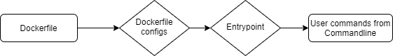

# Advanced Entrypoints, File Configs

Lets go back to to the topics we looked in Exercise 3. Namely, Entrypoints and Commands to set the state of the container. We know that the Entrypoint command in the Dockerfile can specify commands to be ran before user input, but typing out all the commands into that single line can be cumbersome, and prone to error. 

In this lesson, we are going to look at how you can write a bash script that the container will run from its Entrypoint specification.

## The goal

The goal of this container will be pretty simple, we want to create an Ubuntu container with the user Fred, create a group called FredIsCool, then add the root user to the FredIsCool user group. All of this will be done from a short script instead of commands we feed to the Entrypoint command. Additionally, once the script has ran to completion, we want it to then run any extra user input that is supplied at runtime.

## A short Bash lesson
Up to this point we've seen some bash but its best to formally review the commands and methods we will be using in the lesson. In order to accomplish our above goal we will be using the following commands

* `useradd` - adds a user to the operating system and specifies configs for that user such as home directory and default shell

* `groupadd` - creates a new user group 

* `groupmod` - modifies a user group, frequently used for adding users to a group 

## Responsible scripting
Another thing worth mentioning that is somewhat unique to bash is it's error handling - when bash encounters an error in a multi line script, it does not halt by default, nor does it provide useful error messages. By default, bash will continue on to the next line and often not even report the error. This can can range from mildly annoying side effects to <i>extremely</i> destructive behavior depending on what you are doing. That is why we will prepend our bash script (and you should do the same for all bash scripts) with the following command:

`set -eou pipefail` 

What does that do?

* `pipefail` - From gnu manual:
	> If set, the return value of a pipeline is the value of the last (rightmost) command to exit with a non-zero status, or zero if all commands in the pipeline exit successfully

* `-e` exits the script immediately on error

* `-o` used for pipes, causes a pipe to fail immediately if any of the commands in the pipe don't exit successfully. A pipeline can be something like `cat myfile | uniq | wc -l` and the `-o` option would ensure that if either the `cat`,`uniq`, or `wc` commands failed the pipe would immediately be exited. It does this by only setting the pipeline exit code to 0 if all the commands exit successfully

* `-u` treat unset variables as an error and exit immediately. If you do something like `cat $a` without having set the value of `$a` the script will immediately exit.

## General Flow

The reason why we are going into such detail about this methodology is it is generally the same methodology you will use whenever you develop more complex Docker applications, so it's important to understand the abstraction before we dive into the commands

<b>The general flow will be like the below diagram</b>



## Gimme the gosh dang Dockerfile

As you've probably already noticed, theres a Dockerfile in here, as well as an `entrypoint.sh` file. Don't mind the entrypoint file just yet, lets look at what the Dockefile does

```
FROM ubuntu:latest

COPY entrypoint.sh entrypoint.sh

RUN chmod +x entrypoint.sh

RUN apt-get update 

ENTRYPOINT ["./entrypoint.sh"]
```

`FROM ubuntu:latest` - Uses latest ubuntu image

`COPY entrypoint.sh entrypoint.sh` - copies the entrypoint file on the host to the container. Will be in the root directory when the container comes up 

`RUN chmod +x entrypoint.sh` - makes the shell script executable 

`RUN apt-get update` - updates the container, pulls down necessary basic packages

`ENTRYPOINT ["./entrypoint.sh"]` - tells the container to run the entrypoint script that is now on the container


So lets look at that script:

```
#!/bin/bash

set -eou pipefail

useradd Fred -m -s /bin/bash

groupadd -g 1010 FredIsCool

usermod -a -G FredIsCool root

exec "$@"
```

`set -eou pipefail` - our error handling

`useradd Fred -m -s /bin/bash` - creates the user Fred, `-m` says create a home dir for the user, and the `-s` option denotes what shell they will have 

`groupadd -g 1010 FredIsCool` - create the FredIsCool group with GID of 1010

`usermod -a -G FredIsCool root`  - add the root user to the FredIsCool group

`exec "$@"` - after all other previous commands have finished, execute anything else provided to the container. The variable `$@` holds the value of any command passed to the container. Ie if I bring this container up with `docker run -it exercise5_container bash` the value of `$@` is `bash` which is the command for spawning a bash shell.

<b>WARNING</b>

If developing bash scripts on a windows host that will then be executed on a linux host/container you should ALWAYS run `dos2unix.exe` (comes with gitbash) on the bash script. Ie, `dos2unix.exe entrypoint.sh` <b>BEFORE</b> building the container. 

So putting that all together we want to run from this folder:

```
dos2unix entrypoint.sh

docker build -t exercise5 .

docker run bash -it exercise5 bash
```

Then make sure everything came up as it was supposed to!

[!bashoutput](../images/bash_output.png)